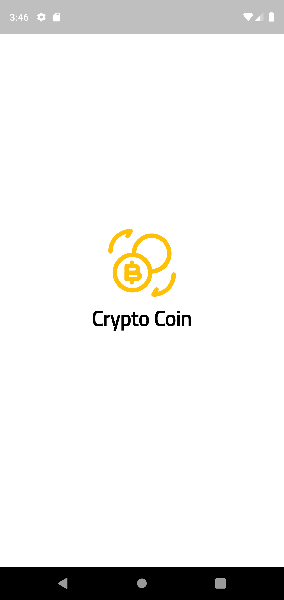

# crypto_coin

This Flutter project focuses on cryptocurrency, with features like:

- track added ctypto coin chnages 
- coin details
- coin changes chart
- crypto market list
- swap coins 

  
<b>:camera: &nbsp;Screenshots</b>

<table>
<tr>
  
<td>

</td>
  
<td>

</td>
  
<td>

</td>
  
</tr>
<tr>
  
<td>

</td>
  
<td>

</td>
  
<td>

</td>
  
</tr>
</table>

## Inspiration
The design inspiration comes from Dribbble, via [this][shot] link.

## Info
State management is [bloc][bloc] and I have try to follow bloc pattern to implement, the cryptocurrency data are from [Coingecko][api] API's.

## Tasks
The following are some tasks I haven't done and you can do them if you're interested:

- [ ] Enhance swap coin
- [ ] Add setting screen
- [ ] Get more coin list by end of screen
- [ ] delete or update coin assets
- [ ] Add [bloc hydrated][hydrated]

[shot]:https://dribbble.com/shots/16111190-Cryptocurrency-App-Design
[bloc]:https://pub.dev/packages/bloc
[api]:https://www.coingecko.com/en/api/documentation
[hydrated]:https://pub.dev/packages/hydrated_bloc
